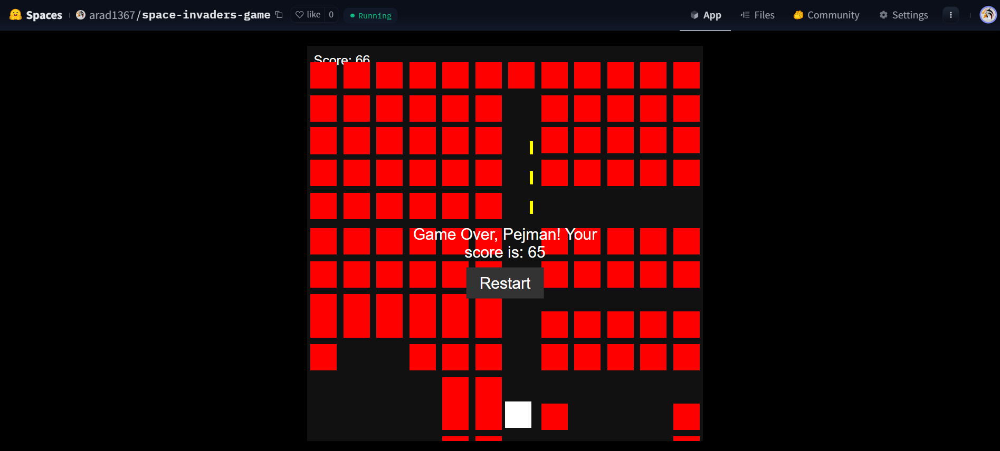

# Space Invaders Game

This is a classic Space Invaders game implemented using HTML, CSS, and JavaScript. It features a player-controlled spaceship shooting down invading aliens.

## Features

- Player can move left and right using arrow keys and shoot using the spacebar.
- Invaders move downward and increase speed over time.
- Scoreboard tracks the player's score.
- Game over screen displays when invaders reach the bottom.
- Restart functionality allows the player to start a new game.

## Music

Background music "Jupiter" used in this game is from the classic Space Invaders game released in 1999.

## How to Play

1. Enter your name and select the difficulty level.
2. Use arrow keys to move and spacebar to shoot.
3. Defeat as many invaders as possible to score points.
4. Avoid letting invaders reach the bottom or the game ends.
5. Click "Restart" to play again after game over.

## Demo

Check out a demo of the game [here](https://huggingface.co/spaces/arad1367/space-invaders-game).

## Installation

Simply download or clone the repository and open `index.html` in your web browser to play.

## Credits

- Original game concept: Classic Space Invaders (1999)
- Music: "Jupiter" from the original Space Invaders game

## License

This project is licensed under the [MIT License](LICENSE).

---

Enjoy playing Space Invaders and have fun defending Earth against the alien invasion!

## Contact
- Pejman Ebrahimi
- email: pejman.ebrahimi77@gmail.com
- email: info@giltech-support.co.uk